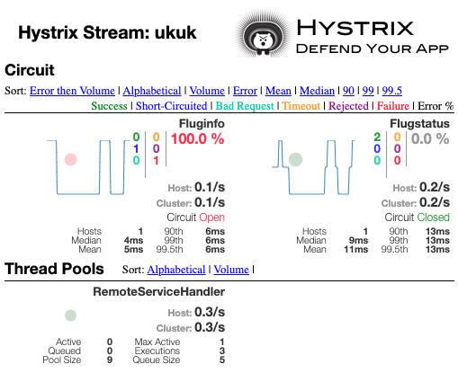

# Cloud Computing Project

von [Laura Zaworski](https://github.com/LauraZaworski), [Sophie Schröder](https://github.com/sophieschrder), [Anna-Frieda Gruse](https://github.com/cosmoem)

Dieses Projekt ist im Rahmen der Lehrveranstaltung "Verteilte System" an der HTW Berlin im WS 19/20 entstanden.

## 1. Aufgabenstellung
Das Ziel war es, eine "sinnvolle" Anwendung zu entwickeln, die aus mindestens drei Microservices besteht, welche miteinander kommunizieren (REST). 
Dabei sollte außerdem eine Datenbank zum speichern von Daten verwendet werden sowie Spring Cloud Services wie z.B. Eureka oder Configuration Server und es sollten mindestens zwei Resilience-Patterns implementiert werden. 
Die Anwendung sollte außerdem als eine Cloud-Anwendung konzipiert sein (IaaS oder PaaS) und gut skalierbar sein.

## 2. Unsere Anwendung
### 2.1 Beschreibung
Mit unserer Anwendung kann ein Nutzer sich aktuelle Informationen zu bevorstehenden Flügen abrufen. Dazu muss er einfach die Flugnummer seines Fluges eingeben und erhält sofort Informationen über Datum, die operierende Fluggesellschaft, Abflugort, Ankunftsort und die Abflugszeit. Des weiteren wird natürlich der Flugstatus angezeigt: "Cancelled", "On Time", "Delayed" oder "Currently Not Available" falls die Information gerade einmal nicht verfügbar sein sollte. 

### 2.2 Aufbau

#### Micorservices

- UI-Service: User Interface
    - User kann anhand einer Flugnummer Informationen über Flüge abrufen
    - Informationen über Flüge kommen vom DB-Service
    - Informationen über Flugstatus kommen von Data-Service
    - aufgesetzt mit Spring Web und Thymeleaf
    - Port 8080
- DB-Service: Informationen über Flüge
    - kommuniziert mit einer MySQL-Datenbank (Port 3306)
    - stellt Fluginformationen über einen API-Endpoint bereit
    - Kommunikation mit API erfolgt über REST
    - Port 8083
- Data-Service: Informationen über Flugstatus
    - generiert Flugstatus pro Flugnummer zufällig (richtige Implementation hätte Rahmen des Projekts gesprengt)
    - stellt Flugstatusinformationen über einen API-Endpoint bereit
    - Kommunikation mit API erfolgt über REST
    - Port 8989

#### Infrastrukturkomponenten

- Service Discovery mit Eureka: erkennt laufende Microservices automatisch
    - Port 8761
- Configuration Server: speichert zentralisiert die Config-Dateien für alle Services 
    - Dateien befinden sich im Verzeichnis `config-server/configs`
    - in den `bootstrap.properties` jedes Services wird die Spring Cloud Config URI angegeben
    - Port 8888

#### Resilience 

- Monitoring & Health Check: mit Eureka
    - Mit Hilfe von Eureka werden nicht nur alle Services automatisch gefunden, sondern es wird auch überprüft, ob sie "gesund" sind/ laufen.
- Circuit Breaker & Fallback & Timeout: mit Hystrix
    - Falls die UI keine Informationen über den Flugstatus vom Data-Service bekommt, aber Verbindung zum DB-Service hergestellt werden kann, werden trotzdem die Fluginformationen angezeigt und statt des Flugstatus einfach "CURRENTLY NOT AVAILABLE" ausgegeben.
    - Falls die UI keine Verbindung zum DB-Service herstellen kann, kann auch nicht überprüft werden, ob die eingegebene Flugnummer überhaupt gültig ist und dementsprechend auch kein Flugstatus ausgegeben werden. Es wird als Fallback ein "leerer Flug" zurückgegeben, welcher dazu führt, dass dem User eine Error-Page angezeigt wird.
    - Falls einer der Remote Services (DB & Data) zu lange braucht um zu antworten oder nicht erreichbar ist, erfolgt ein Timeout. Das ist implizit mit implementiert durch die Nutzung von `@HystrixCommand` und beträgt standardmäßig 1000ms.
    - Nach schon einem Request und nur 1% Fehlschlägen wird die Sicherung geöffnet und bleibt für 10sek offen.
    - Dadurch dass keine Requests mehr durchgelassen werden (Circuit Open), sobald Fehler auftreten, haben die Services gegebenenfalls Zeit sich zu erholen. Es werden aber Fallbacks genutzt, damit der Service zumindest weiterhin halbwegs nutzbar und informativ bleibt.
    - Die derzeitige Konfiguration vom Circuit Breaker ist nicht unbedingt Production-geeignet, macht es aber möglich, das Verhalten zu beobachten. Mit Hilfe des Hystrix Dashboards geht das ganz leicht. Dazu muss einfach http://localhost:8080/hystrix/ http:// aufgerufen werden und der Stream `http://localhost:8080/actuator/hystrix.stream` (manuell gestartet mit Gradle) bzw. `http://config-server:8080/actuator/hystrix.stream` (gestartet mit Skript/ Docker Compose) gemonitored werden. Wenn man nun Requests sendet und z.B. der Data-Service oder der DB-Service offline ist, schlagen diese fehl, der Circuit ist dann geöffnet und weitere Requests innerhalb der nächsten 10sek werden nicht mehr ausgeführt.
    - Die Hystrix-Command-Config befindet sich in `config-server/configs/ui-service.properties` und kann separat für Fluginfo (DB-Service) und Flugstatus (Data-Service) angepasst werden.
    
    
    
- Retries: mit Spring Retry
    - Beim Starten der Anwendung benötigen alle Services ihre Konfigurationen vom Config-Server. Falls dieser noch nicht bereit ist, schlagen Verbindungsversuche fehl. Wenn die Verbindung fehlschlägt, versuchen die Services sich innerhalb von festgelegten Intervallen erneut zu verbinden (max. 5mal). Das gibt dem Config-Server genug Zeit zu starten, ohne dass der Start der gesamten Anwendung fehlschlägt. Die Konfiguration für die Retries befindet sich bei allen Services in den `bootstrap.properties`.

#### Cloud Infrastructure

- Deployments: mit Cloud Foundry (Dev)
    - Cloud Foundry ist ein Platform as a Service Provider und übernimmt für uns das Bereitstellen der Hardware, Virtualisierung, Betriebssystem, Container und Middleware. Wenn wir unsere Anwendung mit Cloud Foundry deployen, müssen wir uns also nicht mehr selbst mit Docker Compose rumschlagen.  
    - Für jeden Service ist das Deployment bereits konfiguriert (`manifest.yml`).
    - Für die MySQL-Datenbank kann ganz einfach an Service mit Cloud Foundry erstellt werden.
    - Alle Services sind schnell und einfach skalierbar.

### 2.3 Starten der Anwendung

#### Starten mit Hilfe eines Skripts (empfohlen)

1. Voraussetzungen

Um die Anwendung starten zu können muss Docker bzw. Docker Compose installiert und gestartet sein.

2. Starten der Anwendung

Alle zum Starten der Anwendung notwendigen Schritte befinden sich im Skript `run.sh` (Builds, Docker Images, Docker Compose). Dieses muss einfach nur im Terminal mit dem Befehl `./run.sh` ausgeführt werden. 
Falls das nicht funktionieren sollte, fehlen vermutlich die Rechte zum ausführen des Skripts. Einfach `chmod u+x run.bat` ausführen und das Skript danach noch einmal laufen lassen.

#### Starten durch manuelles Ausführen

1. Voraussetzungen

Um die Anwendung starten zu können, muss `mysql` lokal installiert sein. Das Passwort des MySQL-root-Users ist derzeit als `systeme` festgelegt und muss entweder so gesetzt werden oder in der Datei `config-server/configs/db-service.properties` geändert werden, damit Datenbankzugriff erfolgen kann. 
Das erstellen der Datenbank sowie das füllen mit Daten passiert dann automatisch.

2. Starten der Anwendung

Beginnend mit `config-server` in jeweils einem neuen Terminal jeden Service einzeln starten mit dem Befehl `./gradlew bootRun`

### 2.4 Nutzen der Anwengun

Die Anwendung kann jetzt im Browser unter https://localhost:8080/flug aufgerufen werden. Es sollte die UI erscheinen, die den User auffordert, eine Flugnummer einzugeben.

Flugnummern, für die Fluginformationen vorhanden sind:

AB459DZ, HRZ6785, EJEK753, LIR0912, JJK8865, KKF890, ABC1234, JB007, GRI6543, T69KL5, X87UL1, OS57LM, EJU5907, LX981, BA8494

### 2.5 Deployment

- Cloud Foundry
    - Für jeden Service gibt es eine `manifest.yml`, in der sich die Deployment-Konfigurationen für Cloud Foundry befinden. Die aktuelle Konfiguration setzt voraus, dass Cloud Foundry Dev verwendet wird (User `admin`, Org `cfdev-org`, Space `cfdev-space`). Die Konfigurationen können fast genau so wie sie sind auch für richtige Deployments auf Cloud Foundry genutzt werden, jedoch müssen die Umgebungsvariablen für alle URIs angepasst werden um dann die richtigen Routes zu repräsentieren.
    - Datenbank
        - Mit dem Befehl `cf create-service p-mysql 20mb mysql` kann für Cloud Foundry Dev ein Datenbankservice mit dem Namen `mysql` erstellt werden. Dieser ist so auch in der `manifest.yml` des db-service erwähnt. Der Plan (`20mb`) und der Service (`p-mysql`) können für Cloud Foundry eventuell abweichen.
        - Nach dem Deployment der App db-service muss der erstellte Service an die App gebunden werden mit `cf bind-service db-service mysql`.
    - Deployments
        - Build jedes Services mit `./gradlew clean build -x`
        - Deployment jedes Services mit `cf push <app-name>` (ausführen im jeweiligen Verzeichnis).
        - Wichtig: Der Config-Server muss als erstes deployed werden, da die anderen Services auf ihn angewiesen sind.
        - Wichtig: Die Datenbank muss erstellt sein bevor der db-service deployed werden kann.
        - Alle Services werden auf Port 8080 deployed. Dafür gibt es extra eine Config mit dem Profil `cloud`. 
- Skalierbarkeit: mit Cloud Foundry
    - Sowohl bei Cloud Foundry Dev als auch Cloud Foundry funktioniert das Skalieren ganz einfach. Mit dem Befehl `cf scale <app-name>` können mit `-i` Instanzen, mit `-k` Disk und mit `-m` Memory skaliert werden während die App läuft.
